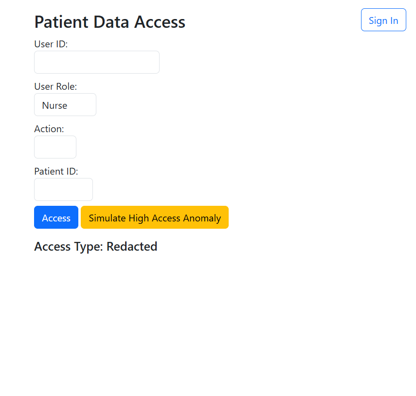
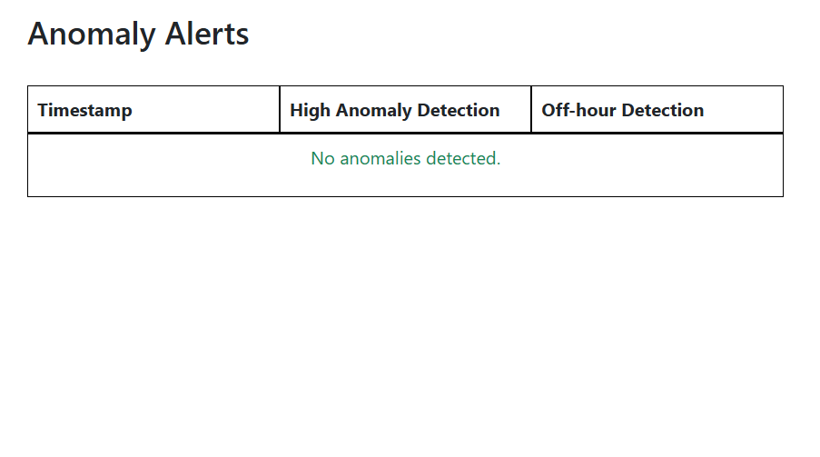

# Healthcare Security App

This project is a healthcare security application that consists of two main components: a user access application and a monitoring application. The user access application allows authorized users to access patient data, while the monitoring application provides insights into access logs and detects anomalies.

## Project Structure

```
healthcare-security-app
├── user_app
│   ├── app.py                # Main application for user access
│   ├── templates
│   │   └── index.html        # HTML template for user interface
│   └── static                # Static files (CSS, JS) for user app
├── monitor_app
│   ├── app.py                # Main application for monitoring access logs
│   ├── templates
│   │   └── dashboard.html     # HTML template for monitoring dashboard
│   └── static                # Static files (CSS, JS) for monitor app
├── healthcare.db             # SQLite database file
├── requirements.txt          # Python dependencies
└── README.md                 # Project documentation
```

## Setup Instructions

1. **Clone the repository**:
   ```
   git clone <repository-url>
   cd healthcare-security-app
   ```

2. **Install dependencies**:
   It is recommended to use a virtual environment. You can create one using:
   ```
   python -m venv venv
   source venv/bin/activate  # On Windows use `venv\Scripts\activate`
   ```
   Then install the required packages:
   ```
   pip install -r requirements.txt
   ```

3. **Run the applications**:
   - For the user access application:
     ```
     cd user_app
     python app.py
     ```
     Access the application at `http://127.0.0.1:5000`.

     The user application should look like this: 

     

   - For the monitoring application:
     ```
     cd monitor_app
     python app.py
     ```
     Access the monitoring dashboard at `http://127.0.0.1:5001`.

     The monitoring application should look like this: 

     

## Usage Guidelines

- **User Access Application**: Users can log in and view patient data. Ensure that you have valid credentials to access the system.
  
- **Monitoring Application**: Administrators can view access logs and detect any anomalies in user access patterns.

## License

This project is licensed under the MIT License. See the LICENSE file for more details.

